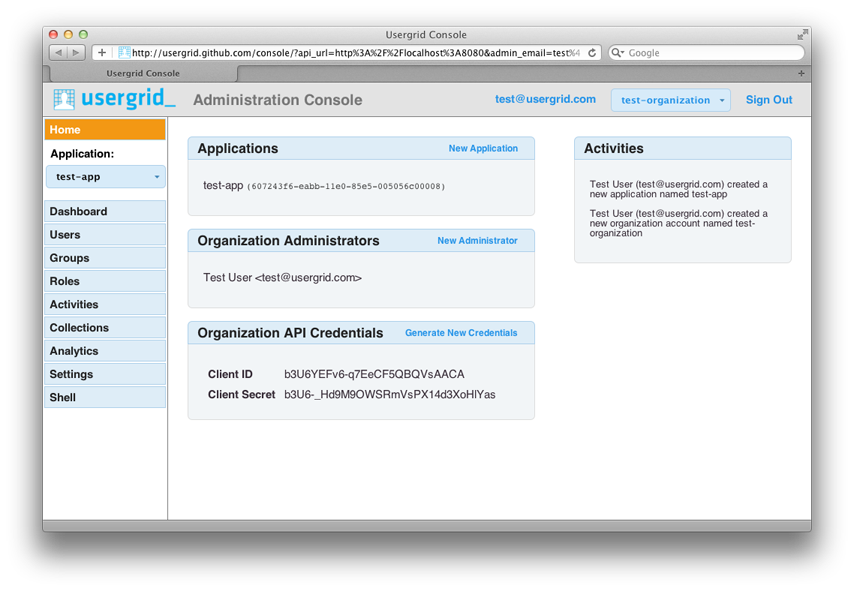
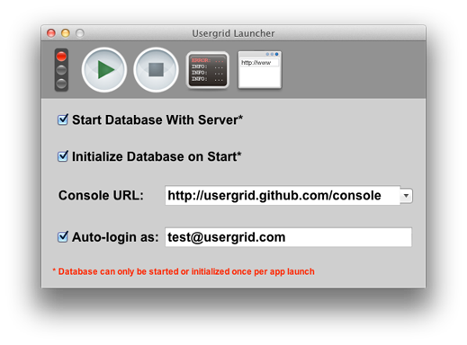

======================================
Getting Started With The Admin Console
======================================

The Usergrid Console is the primary administrative user interface for working
with Usergrid. The Console is also the most complete reference application for
using Usergrid from Javascript and is fully open source and forkable on GitHub
at https://github.com/usergrid/console. This lets you easily extend it or
embed it into your own applications and to inspect the code to see the
recommend ways for interacting with our API. The Usergrid Javascript client is
part of the Console project.

  :sub:`Usergrid Console on Chrome.`

-----------------------
Signing up for Usergrid
-----------------------

You can sign up for the Usergrid.com service via the Console. While
Usergrid.com account creation is entirely performed via our public REST API,
please be aware that there are steps to the signup process for new
Usergrid.com accounts that are performed "sideband". Specifically, new
accounts receive a confirmation email that contains a URL which must be
clicked on to activate the account. This URL is on our website but you can
specify where it redirects to afterwards.

Please note that this is only for Usergrid.com accounts. For your user
accounts, you can completely control the registration flow and there is no
need for it to pass through our website or URLs at all.

-----------------------------------------
Running a standalone server (Recommended)
-----------------------------------------

The easiest way to get started is by launching a personal Usergrid server
through our `Usergrid Launcher <https://usergrid.ci.cloudbees.com/job/Usergrid%20Nightly/lastSuccessfulBuild/org.usergrid$usergrid-launcher/artifact/org.usergrid/usergrid-launcher/0.0.1-SNAPSHOT/usergrid-launcher-0.0.1-SNAPSHOT.jar>`_.
The launcher is a double-clickable Java Jar file that contains everything needed
to run a local instance of Usergrid without performing any installation. It
doesn't modify your system in any way other than to create some database files
in the same directory you launch it from.

Download and execute this jar by double-clicking on it.  

You should be able to see this:

  :sub:`Usergrid launcher.`

Click on the play button and once the "traffic light" becomes green, click on
the top-right icon (The console). It will open up the Usergrid Admin console
in your default web browser pointing to your local Usergrid server (that you
just downloaded). The default behavior is to use the console on GitHub, but
later on, you can download the Console html and run it locally as well if you
want.

------------
Account Home
------------

When you log into the Console, you'll be presented with your Organizations
home dashboard. This will list the applications associated with the current
organization account as well as the recent activities by administrators that
are part of the organization. You'll also be able to see a list of the other
administrators associated with the account and invite new administrators to
the organization.

Administration of Multiple Organizations
----------------------------------------

It's possible to be an administrator for multiple Organizations, although the
Console is designed to primarily let you work within the context of one
Organizations account. There's a popup menu in the upper right hand corner of
the Console where you can easily switch between Organizations accounts that
you have administrative access to.

----------------------------------
Getting Authentication Credentials
----------------------------------

The Console provides a convenient way to retrieve your oAuth credentials for
API access. You can also set your password for HTTP Basic authentication from
the Console. On the Organizations Home page, you can get the oAuth credentials
for Organization-wide access to the Organization settings and all Applications
owned by the Organizations. The Application Dashboard provides access to the
oAuth credentials for that specific Application.

-----------------------------------------
Exploring The API Using The Console Shell
-----------------------------------------

Create A New Application
------------------------

When you create a new Organization account, you'll log in and you'll see that
you don't have any applications associated with that account. Click on "New
Application" in your Organization Home page and you'll be presented with a
dialog box that prompts you for the information need to create a new app. Once
your app is created, a number of options will become enabled for viewing and
administering your app's data. Before you get started with the high-level
tools, you should go to the left-hand sidebar and click the "Shell" button to
try out a few basic API commands.

Shell
-----

The Shell view is the simpler way to get started using the Usergrid API. It provides
a command-line environment within your web browser for trying out interactive
commands.  One thing to keep in mind when using it is that Usergrid API endpoints
usually take the form of::

  http://api.usergrid.com/test-app/users

where "my-app-id" is your application identifier and "users" referes to the
collection of user objects in your application.

When using the Console Shell, you omit everything through the application identifier,
so the above url, which would list all the users in the application "test-app", would
instead simply be::

  /users

If you type the above command into the console shell, it's the same as an HTTP
GET command to the API endpoint for the currently selected console application
(selected using the app pull-down menu in the console's left sidebar). When
you type that in, you should see something like this::

  > /users
  /users
  {
    "action": "get",
    "application": "1c8f60e4-da67-11e0-b93d-12313f0204bb",
    "params": {
      "_": [
        "1315523877714"
      ]
    },
    "path": "/users",
    "uri": "http://api.usergrid.com/1c8f60e4-da67-11e0-b93d-12313f0204bb/users",
    "entities": [],
    "timestamp": 1315523877481,
    "duration": 36
  }
  >

*Please Note* It can take a few moments after you've hit return for the
results of your command to arrive. This is a UI bug that will get fixed in
upcoming releases.

To create a new user object, enter the following and hit return::

  post /users {"username":"john.doe","email":"john.doe@gmail.com"}

*Note* that there is a space after the path and before the JSON representation.

You've now created your first user in your application.  You should see the following displayed as a result::

    > post /users {"username":"john.doe","email":"john.doe@gmail.com"}
    /users
    {
      "action": "post",
      "application": "1c8f60e4-da67-11e0-b93d-12313f0204bb",
      "params": {},
      "path": "/users",
      "uri": "http://api.usergrid.com/1c8f60e4-da67-11e0-b93d-12313f0204bb/users",
      "entities": [
        {
          "uuid": "0e47f040-da71-11e0-b93d-12313f0204bb",
          "type": "user",
          "username": "john.doe",
          "email": "john.doe@gmail.com",
          "created": 1315523992687007,
          "modified": 1315523992687007,
          "metadata": {
            "path": "/users/0e47f040-da71-11e0-b93d-12313f0204bb",
            "collections": {
              "activities": "/users/0e47f040-da71-11e0-b93d-12313f0204bb/activities",
              "feed": "/users/0e47f040-da71-11e0-b93d-12313f0204bb/feed",
              "groups": "/users/0e47f040-da71-11e0-b93d-12313f0204bb/groups",
              "messages": "/users/0e47f040-da71-11e0-b93d-12313f0204bb/messages",
              "queue": "/users/0e47f040-da71-11e0-b93d-12313f0204bb/queue",
              "roles": "/users/0e47f040-da71-11e0-b93d-12313f0204bb/roles",
              "following": "/users/0e47f040-da71-11e0-b93d-12313f0204bb/following",
              "followers": "/users/0e47f040-da71-11e0-b93d-12313f0204bb/followers"
            },
            "sets": {
              "rolenames": "/users/0e47f040-da71-11e0-b93d-12313f0204bb/rolenames",
              "permissions": "/users/0e47f040-da71-11e0-b93d-12313f0204bb/permissions"
            }
          }
        }
      ],
      "timestamp": 1315523992585,
      "duration": 162
    }
    >

Enter the follow command to create another user::

  post /users {"username":"jane.doe","email":"jane.doe@gmail.com"}

You'll see the following result::

    > post /users {"username":"jane.doe","email":"jane.doe@gmail.com"}
    /users
    {
      "action": "post",
      "application": "1c8f60e4-da67-11e0-b93d-12313f0204bb",
      "params": {},
      "path": "/users",
      "uri": "http://api.usergrid.com/1c8f60e4-da67-11e0-b93d-12313f0204bb/users",
      "entities": [
        {
          "uuid": "78c54a82-da71-11e0-b93d-12313f0204bb",
          "type": "user",
          "username": "jane.doe",
          "email": "jane.doe@gmail.com",
          "created": 1315524171347008,
          "modified": 1315524171347008,
          "metadata": {
            "path": "/users/78c54a82-da71-11e0-b93d-12313f0204bb",
            "collections": {
              "activities": "/users/78c54a82-da71-11e0-b93d-12313f0204bb/activities",
              "feed": "/users/78c54a82-da71-11e0-b93d-12313f0204bb/feed",
              "groups": "/users/78c54a82-da71-11e0-b93d-12313f0204bb/groups",
              "messages": "/users/78c54a82-da71-11e0-b93d-12313f0204bb/messages",
              "queue": "/users/78c54a82-da71-11e0-b93d-12313f0204bb/queue",
              "roles": "/users/78c54a82-da71-11e0-b93d-12313f0204bb/roles",
              "following": "/users/78c54a82-da71-11e0-b93d-12313f0204bb/following",
              "followers": "/users/78c54a82-da71-11e0-b93d-12313f0204bb/followers"
            },
            "sets": {
              "rolenames": "/users/78c54a82-da71-11e0-b93d-12313f0204bb/rolenames",
              "permissions": "/users/78c54a82-da71-11e0-b93d-12313f0204bb/permissions"
            }
          }
        }
      ],
      "timestamp": 1315524171329,
      "duration": 110
    }
    >

Now enter the command to list the elements of the "users" collection again::

  /users

You'll see the following::

    > /users
    /users
    {
      "action": "get",
      "application": "1c8f60e4-da67-11e0-b93d-12313f0204bb",
      "params": {
        "_": [
          "1315524221412"
        ]
      },
      "path": "/users",
      "uri": "http://api.usergrid.com/1c8f60e4-da67-11e0-b93d-12313f0204bb/users",
      "entities": [
        {
          "uuid": "0e47f040-da71-11e0-b93d-12313f0204bb",
          "type": "user",
          "created": 1315523992687007,
          "modified": 1315523992687007,
          "email": "john.doe@gmail.com",
          "metadata": {
            "path": "/users/0e47f040-da71-11e0-b93d-12313f0204bb",
            "collections": {
              "activities": "/users/0e47f040-da71-11e0-b93d-12313f0204bb/activities",
              "feed": "/users/0e47f040-da71-11e0-b93d-12313f0204bb/feed",
              "groups": "/users/0e47f040-da71-11e0-b93d-12313f0204bb/groups",
              "messages": "/users/0e47f040-da71-11e0-b93d-12313f0204bb/messages",
              "queue": "/users/0e47f040-da71-11e0-b93d-12313f0204bb/queue",
              "roles": "/users/0e47f040-da71-11e0-b93d-12313f0204bb/roles",
              "following": "/users/0e47f040-da71-11e0-b93d-12313f0204bb/following",
              "followers": "/users/0e47f040-da71-11e0-b93d-12313f0204bb/followers"
            },
            "sets": {
              "rolenames": "/users/0e47f040-da71-11e0-b93d-12313f0204bb/rolenames",
              "permissions": "/users/0e47f040-da71-11e0-b93d-12313f0204bb/permissions"
            }
          },
          "username": "john.doe"
        },
        {
          "uuid": "78c54a82-da71-11e0-b93d-12313f0204bb",
          "type": "user",
          "created": 1315524171347008,
          "modified": 1315524171347008,
          "email": "jane.doe@gmail.com",
          "metadata": {
            "path": "/users/78c54a82-da71-11e0-b93d-12313f0204bb",
            "collections": {
              "activities": "/users/78c54a82-da71-11e0-b93d-12313f0204bb/activities",
              "feed": "/users/78c54a82-da71-11e0-b93d-12313f0204bb/feed",
              "groups": "/users/78c54a82-da71-11e0-b93d-12313f0204bb/groups",
              "messages": "/users/78c54a82-da71-11e0-b93d-12313f0204bb/messages",
              "queue": "/users/78c54a82-da71-11e0-b93d-12313f0204bb/queue",
              "roles": "/users/78c54a82-da71-11e0-b93d-12313f0204bb/roles",
              "following": "/users/78c54a82-da71-11e0-b93d-12313f0204bb/following",
              "followers": "/users/78c54a82-da71-11e0-b93d-12313f0204bb/followers"
            },
            "sets": {
              "rolenames": "/users/78c54a82-da71-11e0-b93d-12313f0204bb/rolenames",
              "permissions": "/users/78c54a82-da71-11e0-b93d-12313f0204bb/permissions"
            }
          },
          "username": "jane.doe"
        }
      ],
      "timestamp": 1315524225021,
      "duration": 59
    }
    >

To retrieve a specific user, try the following::

  /users/jane.doe

You'll see the following::

    > /users/jane.doe
    /users/jane.doe
    {
      "action": "get",
      "application": "1c8f60e4-da67-11e0-b93d-12313f0204bb",
      "params": {
        "_": [
          "1315524419746"
        ]
      },
      "path": "/users",
      "uri": "http://api.usergrid.com/1c8f60e4-da67-11e0-b93d-12313f0204bb/users",
      "entities": [
        {
          "uuid": "78c54a82-da71-11e0-b93d-12313f0204bb",
          "type": "user",
          "created": 1315524171347008,
          "modified": 1315524171347008,
          "email": "jane.doe@gmail.com",
          "metadata": {
            "path": "/users/78c54a82-da71-11e0-b93d-12313f0204bb",
            "collections": {
              "activities": "/users/78c54a82-da71-11e0-b93d-12313f0204bb/activities",
              "feed": "/users/78c54a82-da71-11e0-b93d-12313f0204bb/feed",
              "groups": "/users/78c54a82-da71-11e0-b93d-12313f0204bb/groups",
              "messages": "/users/78c54a82-da71-11e0-b93d-12313f0204bb/messages",
              "queue": "/users/78c54a82-da71-11e0-b93d-12313f0204bb/queue",
              "roles": "/users/78c54a82-da71-11e0-b93d-12313f0204bb/roles",
              "following": "/users/78c54a82-da71-11e0-b93d-12313f0204bb/following",
              "followers": "/users/78c54a82-da71-11e0-b93d-12313f0204bb/followers"
            },
            "sets": {
              "rolenames": "/users/78c54a82-da71-11e0-b93d-12313f0204bb/rolenames",
              "permissions": "/users/78c54a82-da71-11e0-b93d-12313f0204bb/permissions"
            }
          },
          "username": "jane.doe"
        }
      ],
      "timestamp": 1315524421071,
      "duration": 107
    }
    >

Now, let's add some information to this user, type the following::

  put /users/jane.doe {"city" : "san francisco" }

You should see the following::

    > put /users/jane.doe {"city" : "san francisco" }
    /users/jane.doe
    {
      "action": "put",
      "application": "1c8f60e4-da67-11e0-b93d-12313f0204bb",
      "params": {},
      "path": "/users",
      "uri": "http://api.usergrid.com/1c8f60e4-da67-11e0-b93d-12313f0204bb/users",
      "entities": [
        {
          "uuid": "78c54a82-da71-11e0-b93d-12313f0204bb",
          "type": "user",
          "created": 1315524171347008,
          "modified": 1315524526405008,
          "city": "san francisco",
          "email": "jane.doe@gmail.com",
          "metadata": {
            "path": "/users/78c54a82-da71-11e0-b93d-12313f0204bb",
            "collections": {
              "activities": "/users/78c54a82-da71-11e0-b93d-12313f0204bb/activities",
              "feed": "/users/78c54a82-da71-11e0-b93d-12313f0204bb/feed",
              "groups": "/users/78c54a82-da71-11e0-b93d-12313f0204bb/groups",
              "messages": "/users/78c54a82-da71-11e0-b93d-12313f0204bb/messages",
              "queue": "/users/78c54a82-da71-11e0-b93d-12313f0204bb/queue",
              "roles": "/users/78c54a82-da71-11e0-b93d-12313f0204bb/roles",
              "following": "/users/78c54a82-da71-11e0-b93d-12313f0204bb/following",
              "followers": "/users/78c54a82-da71-11e0-b93d-12313f0204bb/followers"
            },
            "sets": {
              "rolenames": "/users/78c54a82-da71-11e0-b93d-12313f0204bb/rolenames",
              "permissions": "/users/78c54a82-da71-11e0-b93d-12313f0204bb/permissions"
            }
          },
          "username": "jane.doe"
        }
      ],
      "timestamp": 1315524526343,
      "duration": 84
    }
    >

Let's create another type of object.  Type the following::

  post /cats {"name" : "felix"}

You'll see the following::

    > post /cats {"name" : "felix"}
    /cats
    {
      "action": "post",
      "application": "1c8f60e4-da67-11e0-b93d-12313f0204bb",
      "params": {},
      "path": "/cats",
      "uri": "http://api.usergrid.com/1c8f60e4-da67-11e0-b93d-12313f0204bb/cats",
      "entities": [
        {
          "uuid": "89a05d85-da72-11e0-b93d-12313f0204bb",
          "type": "cat",
          "created": 1315524629123008,
          "modified": 1315524629123008,
          "metadata": {
            "path": "/cats/89a05d85-da72-11e0-b93d-12313f0204bb"
          },
          "name": "felix"
        }
      ],
      "timestamp": 1315524629068,
      "duration": 107
    }
    >

Now let's update this object::

  put /cats/felix {"color" : "black"}

You'll see the following results::

    > put /cats/felix {"color" : "black"}
    /cats/felix
    {
      "action": "put",
      "application": "1c8f60e4-da67-11e0-b93d-12313f0204bb",
      "params": {},
      "path": "/cats",
      "uri": "http://api.usergrid.com/1c8f60e4-da67-11e0-b93d-12313f0204bb/cats",
      "entities": [
        {
          "uuid": "89a05d85-da72-11e0-b93d-12313f0204bb",
          "type": "cat",
          "created": 1315524629123008,
          "modified": 1315524724093008,
          "color": "black",
          "metadata": {
            "path": "/cats/89a05d85-da72-11e0-b93d-12313f0204bb"
          },
          "name": "felix"
        }
      ],
      "timestamp": 1315524724058,
      "duration": 57
    }
    >

You can now click on the "Collections" button in the sidebar to see all the
collections in your application. You'll see that there's two objects in the
"users" collection and one in the "cats" collection. Feel free to navigate
around and see how the Collections explore provides a high-level alternative
to the API for viewing and manipulating your application objects.

This shows the basics of creating and updating objects in Usergrid. Subsequent
sections of the documentation will provide more detail on how this all works.
