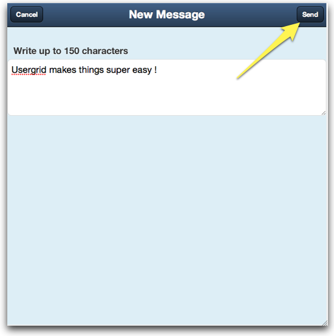

====================
Running the examples
====================

Running the examples is the best way to have a full view of the functionality
that Usergrid provides. We will start off with **Twid**, a simple
Twitter-style messages app.

The next steps will guide you to download and install the standalone Usergrid
server (through its launcher) and run the Twid app. Twid is built as a
PhoneGap app but we're going to show it running in a browser for simplicity.

.. note:: The following steps have been tested on Safari and Chrome. Running
   in Firefox or IE will likely result in unexpected behavior.

Twid
=====

**1.** First, click `here
<https://usergrid.ci.cloudbees.com/job/Usergrid%20Nightly/lastSuccessfulBuild/org.usergrid$usergrid-launcher/artifact/org.usergrid/usergrid-launcher/0.0.1-SNAPSHOT/usergrid-launcher-0.0.1-SNAPSHOT.jar>`_ to
download the standalone server launcher and double-click on the file once it
has been downloaded. Click on the start button and wait for the light to turn
green.

**2.** Open the *Usergrid Admin Console* by clicking on the top-right icon of
the launcher app (Step 1).

  :sub:`Usergrid Console icon.`

**3.** Let's create the application. Go ahead and click on **New Application**
as indicated in the next figure:

**4.** Enter **twid** as the app name.

**5.** We need to create a user that is going to be our test user to log in to
our *Twid* app. Make sure your console has *Twid* as the active app (if it's
not, click on the drop-down **(1)** ) and click on the *Users* box (on the
left side of the console **(2)** ).

.. figure:: _static/console_create_app3.png

**6.** Click on the **New User** button:

.. figure:: _static/console_create_app4.png

**7.** Enter the user info as indicated (enter your own password) and click on
**Create** button when you are done:

So far, we've created our app called *twid* as well as a user account
associated with the app. We will use that user account to log into our new app
using a mobile app that can be run in a browser.

**8.** Now you need to launch Safari or Google Chrome. In case of Google
Chrome it should be launched this way (shut it down if it is already running):

``/Applications/Google\ Chrome.app/Contents/MacOS/Google\ Chrome --allow-file-access-from-files``

The special launch options are necessary because Chrome has additional
security restrictions that will prevent the app from being able to make
network connections.

**9.** Paste this url or just click on it:
`<http://usergrid.github.com/samples/Twid/index.html?api_url=http://localhost:8080>`_

**10.** Log in to *Twid* by entering the information we used to create our
user account in the **step 7** and click on the *Save* button located on the
bottom-right area.

.. figure:: _static/twid_login.png

**11.** Let's post a message. Click on the top-right icon in order to create a
new message, write a message and send it.

.. figure:: _static/twid_msg1.png

**Note:** The message should appear in the Message Board within few
seconds.

**12.** Now for *Twid* to act as Twitter we need to follow another user.
Repeat the steps **5, 6 & 7** but this time name the user *twid-test2*.

**13.** Get back to our Twid app window and add *twid-test* as a follower of
*twid-test2* Click OK to confirm.

.. figure:: _static/twid_friend.png

**14.** Open a tab in same browser or in another window and log in as
*twid-test2*:
`<http://usergrid.github.com/samples/Twid/index.html?api_url=http://localhost:8080>`_
and post a message as indicated in **step 11**.

**16.** Get back to the window where *twid-test1* was logged in. *twid-test*
will see the message sent by *twid-test2*.

.. figure:: _static/twid_msg3.png

You can now look at the source for Twid on GitHub at::

  http://usergrid.github.com/samples

